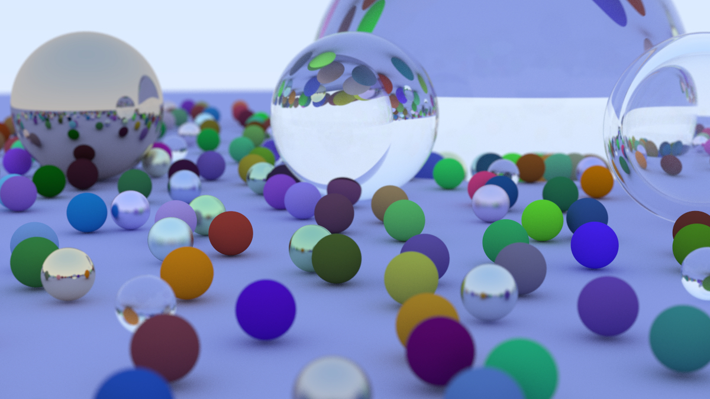

# Rust raytracer

This is a simple raytracer based on Peter Shirley's book [Ray Tracing in One
Weekend](https://raytracing.github.io/books/RayTracingInOneWeekend.html).

The image above is an example created with this raytracer.

Shapes:
- ☑️ Sphere 
- ⬜ Triangle
- ⬜ Others

Lighting:
- ⬜ Light sources

Material: 
- ☑️ Lambertian 
- ☑️ Dielectric 
- ☑️ Metal 
- ⬜ Smoke
- ⬜ Image texture

Implementation:
- ☑️ Multi-threaded 
